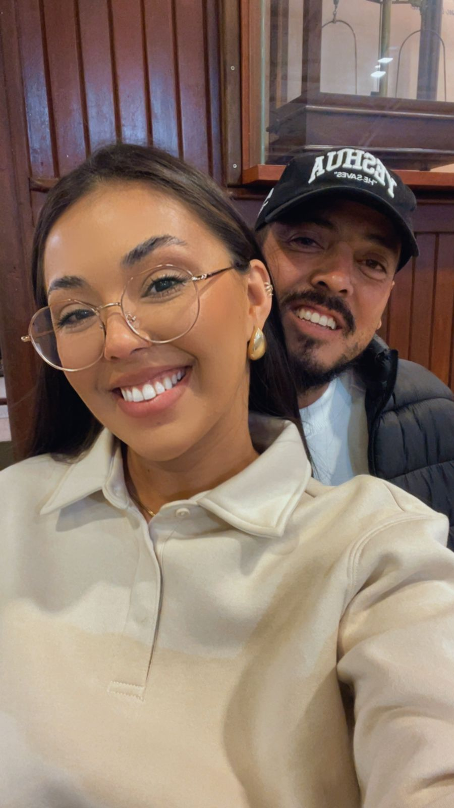

# Convite de Casamento — Francieli & Carlos Eduardo

Convite digital (página única) com contagem regressiva, painel de confirmação de presença e mural de fotos.

**Data:** 06 de fevereiro de 2027, às 11h · É da Pam Café Colonial

## Imagens usadas (coloque na mesma pasta do index.html)

| Arquivo      | O que é                        |
|--------------|--------------------------------|
| `logo.png`   | Logo do casal (aparece no topo)|
| `fundo.png`  | Pattern do fundo claro         |
| `foto1.jpg`  | Mural — foto 1                 |
| `foto2.jpg`  | Mural — foto 2                 |
| `foto3.jpg`  | Mural — foto 3                 |

> O código já referencia esses nomes. Se um arquivo não existir, ele simplesmente não aparece (sem quebrar o layout).

## Como personalizar

### WhatsApp do casal (já configurado: (41) 9 8535-0234)
No final do `index.html`, dentro do `<script>`:
```js
var WHATSAPP = "5541985350234"; // 55 (Brasil) + DDD + número, só dígitos
```

### Intensidade do pattern de fundo
No CSS, em `body::before`, ajuste `opacity:.16` (menor = mais suave).

### As 3 fotos do mural
Procure por `<!-- Substitua o conteúdo de cada <figure> -->` e troque cada bloco `<div class="ph">...</div>` por uma imagem:
```html
<figure></figure>
```
Coloque as imagens `foto1.jpg`, `foto2.jpg`, `foto3.jpg` na mesma pasta do `index.html`.

## Como publicar
É só um arquivo `index.html` — pode subir em qualquer hospedagem estática (GitHub Pages, Netlify, Vercel) ou abrir direto no navegador.

## Recursos
- ⏳ Contagem regressiva automática até a data
- 🤍 Painel de confirmação de presença (salva no dispositivo + envia pro WhatsApp do casal)
- 🖼️ Mural de 3 fotos
- 📖 História do casal
- 📍 Botão "Ver no mapa"
- 📱 Responsivo (celular e desktop)
